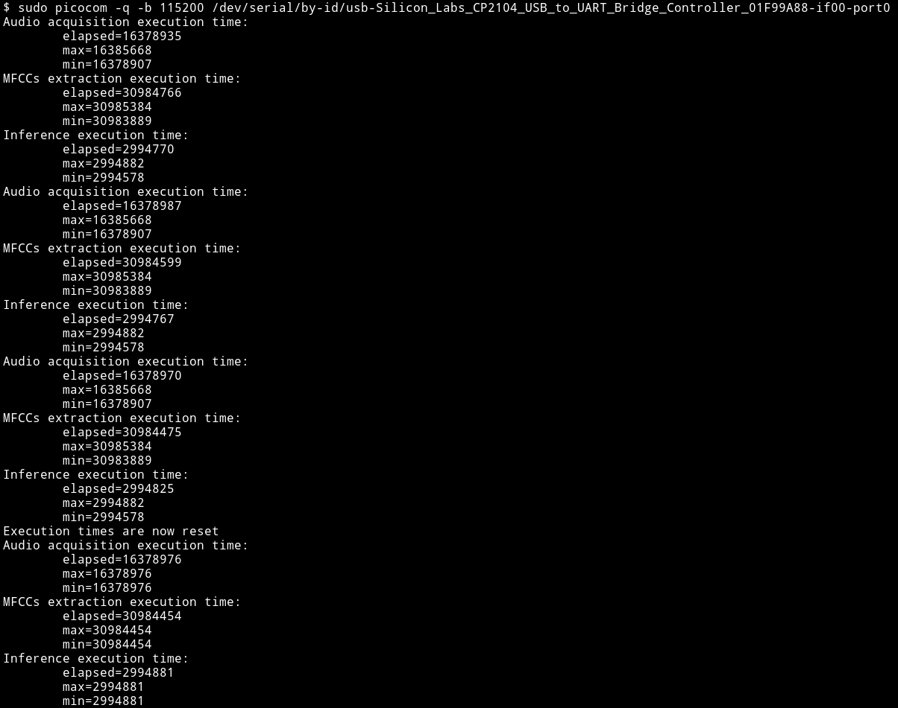

<!-- PROJECT SHIELDS -->

<!-- PROJECT LOGO -->
 

  <h3 align="center">stm32-speech-recognition-and-traduction</h3>

<!-- TABLE OF CONTENTS -->

  
Table of Contents

  <ol>
    <li>
      <a href="#about-the-project">About The Project</a>
      <ul>
        <li><a href="#built-with">Built With</a></li>
      </ul>
    </li>
    <li>
      <a href="#getting-started">Getting Started</a>
      <ul>
        <li><a href="#prerequisites">Prerequisites</a></li>
      </ul>
    </li>
    <li>
      <a href="#usage">Usage</a>
    </li>
    <li><a href="#license">License</a></li>
    <li><a href="#contact">Contact</a></li>
  </ol>

<!-- ABOUT THE PROJECT -->
## About The Project

stm32-speech-recognition-and-traduction is a project developed for the Operating Systems Design exam at the University of Milan (academic year 2020-2021).
It implements a speech recognition and speech-to-text translation system using a pre-trained machine learning model.
The system is able to distinguish a restricted set of words to limit the complexity of the final model so that it can be run on the stm32f407vg microcontroller
where memory and calculation capacity are limited. In particular, the voice recognition system distinguishes simple commands such as switching the LEDs on and off
and enabling the translation system. The latter, on the other hand, processes the voice signal by converting it into text, which is then displayed on the screen.

### Built With

* [TensorFlow Lite](https://www.tensorflow.org/lite/microcontrollers)
* [Google Colaboratory](https://colab.research.google.com/)
* [BSP](https://www.st.com/resource/en/user_manual/dm00440740-stm32cube-bsp-drivers-development-guidelines-stmicroelectronics.pdf)
* [PDM2PCM](https://www.st.com/resource/en/user_manual/um2372-stm32cube-pdm2pcm-software-library-for-the-stm32f4f7h7-series-stmicroelectronics.pdf)
* [STM32_AI_AudioPreprocessing_Library](https://www.st.com/en/embedded-software/stm32-audio100a.html)
* [CMSIS DSP](https://developer.arm.com/tools-and-software/embedded/cmsis)
* [X-CUBE AI](https://www.st.com/en/embedded-software/x-cube-ai.html)
* [Picocom](https://linux.die.net/man/8/picocom)

<!-- GETTING STARTED -->
## Getting Started

## Required libraries

To correctly build this project, you'll need the [X-CUBE AI](https://www.st.com/en/embedded-software/x-cube-ai.html) and [PDM2PCM](https://www.st.com/resource/en/user_manual/um2372-stm32cube-pdm2pcm-software-library-for-the-stm32f4f7h7-series-stmicroelectronics.pdf) ST libraries. You can download them directly from ST official website and install in the root level of this project.

### Prerequisites

* STM32F407VG board, equipped with both UART/USART interface and ST-MEMS digital microphone
* USART-USB dongle to connect the pins of the UART/USART interface to a PC via USB

<!-- USAGE EXAMPLES -->
## Usage
To enable the microphone mounted on the microcontroller to acquire a new word, the user B1 button must be pressed. Once this is done, a one-second audio signal is acquired. Depending on the word spoken, different actions are performed.
* Say the word ON twice in succession; this word enables the printing system on the terminal.
 

  

 
 
 

* Say the word OFF, after pronouncing the word ON.
 

  

 
 
 

* Say various words, after pronouncing the word ON, followed by the pronunciation of the word OFF.
 

  

 
 
 

* Say ONE to turn on the green LED, after the word ON has been pronounced.
 

  

 

  

 
 
 

* Say TWO to turn on the blue LED, after the word ON and ONE has been pronounced.
 

  

 

  

 
 
 

* Say THREE to turn on the red LED, after the word ON, ONE and TWO has been pronounced.
 

  

 

  

 
 
 

* Say FOUR to turn on the orange LED, after the word ON, ONE, TWO and THREE has been pronounced and followed by the word OFF
 

  

 

  

 
 
 

* Say the word VISUAL three times in succession to show the calculation of the execution time statistics. This is followed by the pronunciation of the word STOP, followed by the pronunciation of the word VISUAL to show the reset of the execution times (expressed in clock cycles).
 

  

 
 
 

<!-- LICENSE -->
## License

Distributed under the BSD 2-Clause License. See `LICENSE` for more information.

<!-- CONTACT -->
## Contact

Federica Paoli' - federicapaoli1@gmail.com
 
Stefano Taverni - ste.taverni@gmail.com

Project Link: [https://github.com/FedericaPaoli1/stm32-speech-recognition-and-traduction](https://github.com/FedericaPaoli1/stm32-speech-recognition-and-traduction)
